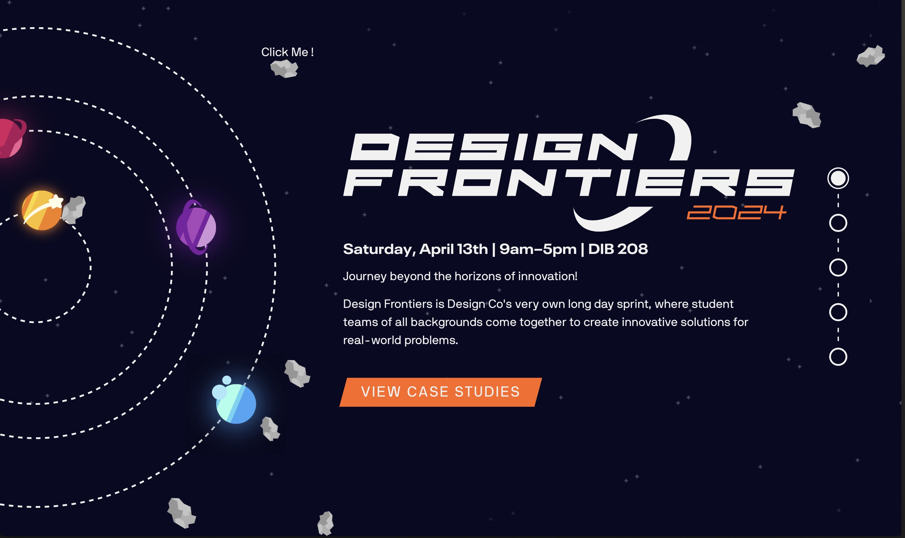
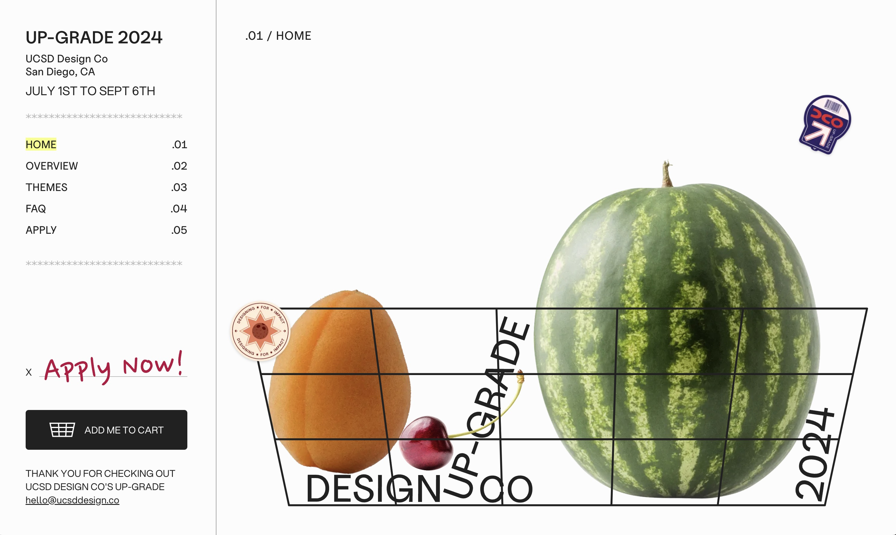
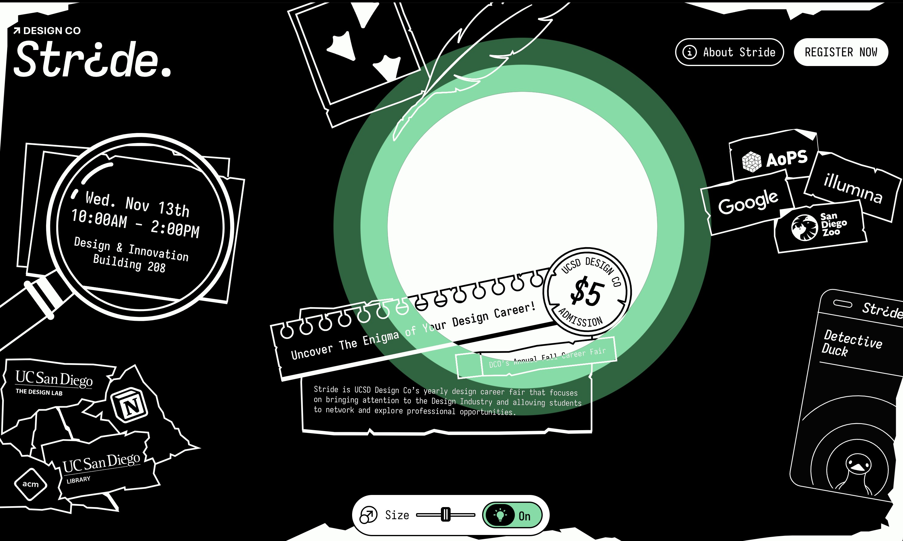
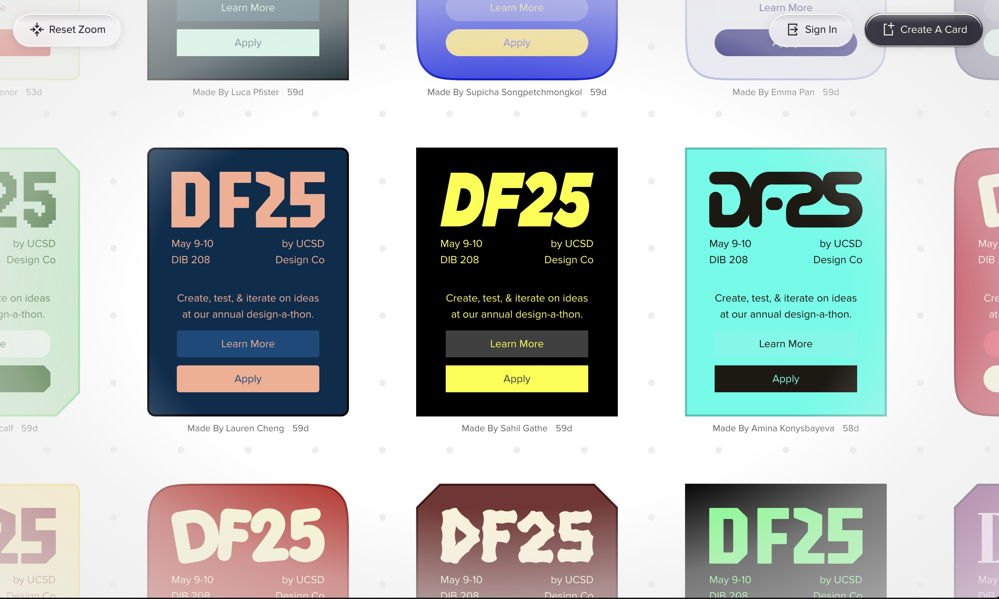

<h1 align='center'>Hello There I'm Sahil 👋</h1>

 
 

 

<h3 align="left">About me 🏎️:</h3>

I'm a new grad computer science major at UC San Diego. I started programming cause I wanted to make videogames and now loves to make cool websites.

 

<h2>My Experiences 🔭</h2>

**Fullstack Software Engineer** \
[**Doceo**](https://www.linkedin.com/company/doceo-technologies/posts/?feedView=all)\
Languages & Technologies: `React`, `WorkOS`, `OAuth 2.0`, `Convex`, `Web App Development`\
 

**Software Engineer Intern** \
[**Center for Health Design**](https://c4h.ucsd.edu/) • Internship \
Languages & Technologies: `Unity`, `Javascript`, `C#`, `MR/AR Development`\
 

<a href="https://cer.ucsd.edu/">

</a>
**Student Software Engineer** \
[**UC San Diego Center for Energy Research**](https://cer.ucsd.edu/)\
Languages & Technologies: `React Native`, `Javascript`, `CSS`, `Mobile Development`\
 

**Web Developer** \
[**Design Co**](https://designco-revamp.vercel.app/) • Club \
Languages & Technologies: `React`, `Javascript`, `Sass`, `Responsive Web Design`\
 

 

<h2>Websites I've Worked On 🚀</h2>

 

### [**Design Frontiers**](https://df25.designatucsd.com/) • 2024 
<!-- Languages & Technologies: `React`, `Javascript`, `Sass`, `Responsive Web Design`\ -->
 

 

### [**Upgrade**](https://upgrade24.designatucsd.com/) • 2024 
<!-- Languages & Technologies: `React`, `Javascript`, `Sass`, `Responsive Web Design`\ -->
 

 

### [**Stride**](https://stride24.designatucsd.com/) • 2025 
<!-- Languages & Technologies: `React`, `Javascript`, `Sass`, `Responsive Web Design`\ -->
 

 

### [**Design Frontiers**](https://df25.designatucsd.com/) • 2025 
<!-- Languages & Technologies: `React`, `Javascript`, `Sass`, `Responsive Web Design`\ -->
 

